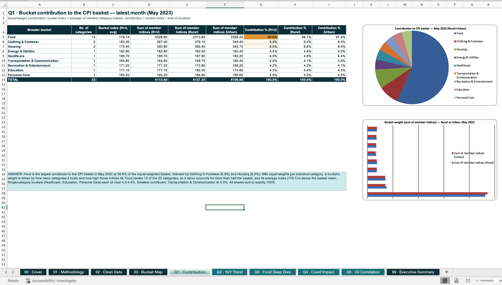

# CPI Inflation — Analytical Case Study (Excel)

An end-to-end Excel case study on India's Consumer Price Index, built from raw
NSO (MoSPI) data covering **Jan 2013 – May 2023**, across **Rural, Urban and
Rural+Urban** sectors and **27 published categories**.

The 27 categories are mapped into 9 broader buckets (Food, Housing, Healthcare,
Energy & Utilities, Transportation & Communication, Education, Clothing &
Footwear, Personal Care, Essential Services) and five business questions are
answered with live formulas, every figure traces back to the raw data.
--- 

## Case Study Preview

---

## Dataset

| Item | Detail |
|---|---|
| Source | [Coding Ninjas](https://www.codingninjas.com/) |
| Coverage | Jan 2013 – May 2023, monthly |
| Sectors | Rural, Urban, Rural+Urban |
| Categories | 27 published categories (23 used after excluding aggregates) |
| Extra data | Brent crude USD/bbl monthly average, 2021–2023 |

---

## Workbook structure

| Sheet | Purpose |
|---|---|
| `00 · Cover` | Scope, contents, headline numbers |
| `01 · Methodology` | Cleaning rules, imputation log, bucket design, formulas, colour code |
| `02 · Clean Data` | Imputed master data with `Month_No` and bucket indices |
| `03 · Bucket Map` | Individual category → broader bucket mapping |
| `Q1 · Contribution` | Bucket contribution to the May-2023 basket |
| `Q2 · YoY Trend` | YoY inflation of General Index from 2017 + peak-year diagnosis |
| `Q3 · Food Deep Dive` | 12 months to May-2023: MoM %, absolute change, top contributor |
| `Q4 · Covid Impact` | Pre vs post Mar-2020 inflation: health, food, essential services |
| `Q5 · Oil Correlation` | Brent crude vs bucket inflation, Pearson `CORREL` sensitivity |
| `99 · Executive Summary` | All five answers, numbers and recommendations on one page |

---

## Methodology

- **Weights:** equal weights across categories (per case-study instruction). Bucket index = simple
  average of its member category indices.
- **Aggregates excluded:** *Food and beverages, Clothing and footwear, Miscellaneous, General index*
  are published aggregates — excluded from bucket construction to avoid double counting. General
  index is used only as the headline series.
- **Contribution:** bucket share in month *t* = bucket index ÷ sum of all bucket indices × 100
  (shares sum to exactly 100%).
- **Inflation formulas:**
  - `MoM % = (CPI_t / CPI_t-1 − 1) × 100`
  - `YoY % = (CPI_t / CPI_t-12 − 1) × 100`
  - `Absolute change = CPI_t − CPI_t-12` (index points)
- **Never sum a CPI:** CPI is an index, not a price. Only ratios and differences within the same
  category are used.
- **Missing values:** `NA` and `-` treated as missing, imputed with a trailing 3-month moving
  average; linear interpolation for isolated gaps. Rural Housing is unpublished, so the
  Rural+Urban housing index is used as a proxy and flagged.
- **May-2020 caveat:** NSO suspended field collection in the first lockdown; affected cells are
  imputed by the same rule and listed in the imputation log.
- **Colour code:** blue = hardcoded input · black = formula · green = cross-sheet link.

---

## Headline numbers

| Metric | Value |
|---|---|
| Latest month | May 2023 |
| General Index (Rural+Urban) | 179.1 |
| YoY inflation (May-23) | 4.31% |
| Peak inflation year | 2022 (6.62% average) |
| Top bucket by weight | Food (56.6%) |

---

## The five questions and answers

**Q1 — Which bucket contributes most to the CPI basket (May 2023)?**
Food, at **56.6%** of the equal-weighted basket, ahead of Clothing & Footwear (8.9%) and Housing
(8.5%). Food carries 13 of the 23 categories and its average index (179.1) sits above the basket
mean. Single-category buckets (Healthcare, Education, Personal Care) sit near 4.0–4.4%; the
smallest is Transportation & Communication at 4.0%. Shares sum to exactly 100%.

**Q2 — Which year since 2017 had the highest inflation, and why?**
**2022, at 6.62% average YoY** (peak month 7.79%). Imported cost-push: Brent crude averaged
~USD 100/bbl after the Russia–Ukraine war, edible oil and fertiliser imports repriced, wheat output
fell on a March heatwave, and a weak rupee amplified every imported input. The RBI responded with
225 bps of repo hikes. Lowest year in the window: 2017 at 3.33%.

**Q3 — Food deep dive, 12 months to May-2023.**
The food bucket moved from 173.82 to 179.14 (**+5.32 index points, 3.06% food inflation**).
Highest MoM: **June-2022 (+0.96%)**. Lowest MoM: **February-2023 (−0.54%)**. Biggest individual
contributor: **Spices, +33.10 index points = 28.0% of the entire food-bucket rise** (spice and
cereal supply tightness plus higher farm input costs). Weakest: Oils and fats (−32.40 pts).

**Q4 — COVID impact (pre vs post March-2020).**
The lockdown reshaped the inflation mix rather than lifting every group equally.
- **Food: 2.85% → 7.48% (+4.63 pp)** — mandis shut, inter-state trucking stopped, perishables could
  not reach markets; food YoY peaked above 10% in Apr-2020.
- **Essential services: 4.45% → 5.82% (+1.37 pp)** — driven by record fuel excise duty in May-2020
  even though global crude had crashed.
- **Healthcare: 6.72% → 6.23% (−0.48 pp)** — already the fastest-inflating group *before* COVID and
  still structurally high, peaking at **9.39% in May-2021** during the Delta wave. The pandemic
  shifted its timing, not its level.
- Largest structural break overall: **Food (+4.63 pp)**.

**Q5 — Which bucket is most sensitive to imported crude oil (2021–2023)?**
Sensitivity measured as Pearson correlation `R` between MoM % change in Brent crude and MoM %
inflation of each bucket (`=CORREL(crude_range, bucket_range)`).

| Bucket | Correlation (R) | Reading |
|---|---|---|
| Energy & Utilities | **+0.113** | Kerosene, LPG and power inputs are crude-linked |
| Transportation & Communication | +0.107 | Pump prices flow into fares and freight |
| Housing | +0.104 | Rents are contractual — near-insulated from crude |
| Healthcare | +0.084 | Petrochemical inputs in consumables; mostly regulated |
| Food | +0.074 | Crude raises fertiliser, farm diesel and freight costs |
| Education | **−0.117** | Fee-regulated, negligible energy pass-through |

**Answer: Energy & Utilities is the most crude-sensitive bucket; Education the least.**

### How to read `R`
`R` is the Pearson correlation coefficient, ranging −1 to +1. It measures how tightly two series
move together, *not* how large the effect is. `R = +0.113` means Energy & Utilities moves in the
same direction as crude only weakly on a same-month basis — pass-through in India is lagged by one
to two months and cushioned by excise duty and LPG subsidy adjustments. Education's small negative
`R` reflects administered fees that are set annually and are unrelated to crude.

---

## What this means

- Food is both the heaviest and most volatile part of the basket — headline CPI management in India
  is, in practice, food-supply management (buffer stocks, export curbs, mandi logistics).
- Crude is the second lever: a 10% crude move shows up in transport and food within one to two
  months, so excise policy is an inflation instrument, not just a revenue one.
- Healthcare runs persistently above headline inflation in both the pre- and post-COVID windows —
  a structural affordability problem, not a pandemic blip.
- Rural and urban baskets diverge: rural inflation is more food-led, urban more services and
  transport-led, so a single national number hides two different problems.

---

## Skills demonstrated

Data cleaning and imputation · index vs price reasoning · bucket/taxonomy design ·
MoM / YoY / absolute-change analytics · contribution decomposition ·
correlation and sensitivity analysis (`CORREL`) · lookup and dynamic formulas
(`INDEX`/`MATCH`, `SUMPRODUCT`, `AVERAGEIFS`) · audit-friendly workbook design ·
macro-economic interpretation and executive communication.

## How to use

1. Open `CPI_Inflation_Case_Study.xlsx`.
2. Start at `00 · Cover`, read `01 · Methodology` for assumptions.
3. Each `Q*` sheet is self-contained: working table on top, `ANSWER` block at the bottom.
4. `99 · Executive Summary` gives all five answers on one page.

## Limitations

Equal weights are a case-study simplification — official CPI uses consumption-expenditure weights,
so contribution shares here are structural, not official. Apr–May 2020 values are imputed.
Rural Housing uses a Rural+Urban proxy. Correlation is not causation and is measured
contemporaneously; a lagged model would likely show stronger crude pass-through.

## Built By Jayesh
**Data Analyst**
[LinkedIn](https://www.linkedin.com/in/jayesh-s-5566b9220/) · [Portfolio](https://jayesh-analytics.github.io/)
